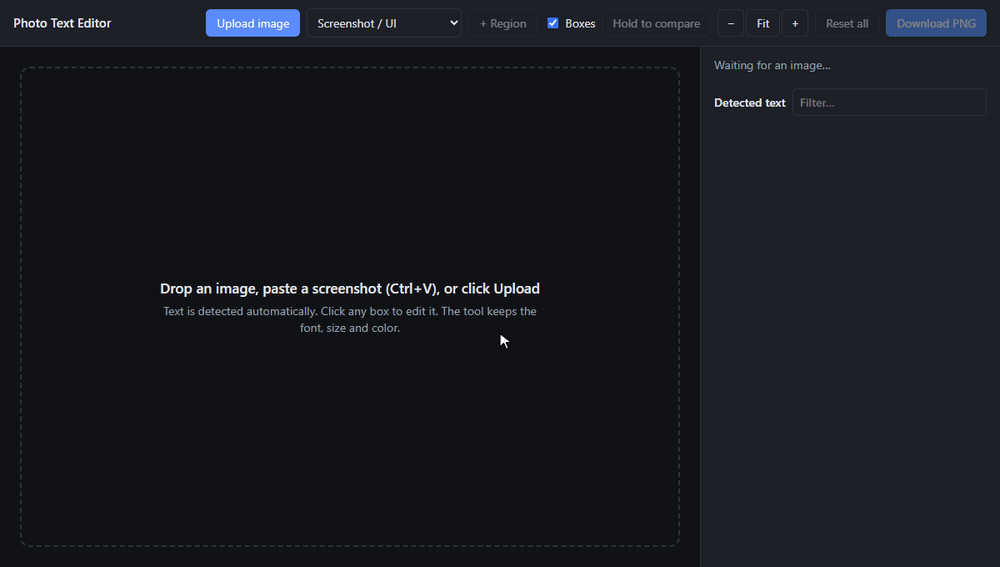

# Photo Text Editor

**Edit text in any screenshot. It matches the exact font, size and color.**
Runs entirely in your browser; your image is never uploaded.

### [▶ Try it live](https://thrishal12345.github.io/photo-text-editor/)

Upload a screenshot or photo and every line of text is detected automatically. Click any line
and retype it. The new text is drawn in the original font, weight, size and color at the same
position, and the old text is erased cleanly, even on buttons, dark mode, gradients and photos.

**Good for:**
- Fixing typos in documentation or marketing screenshots without re-taking them
- Updating outdated tutorials when a UI label or menu name changes
- Translating or localizing UI screenshots
- Quick design mockups: try new copy on a real screen
- Hiding names or numbers by replacing them with placeholder text

## Run it locally

The live link above needs nothing installed. To run it yourself, open `index.html` in Chrome
or Edge (double-click it). There's no build step and no install. You need an internet
connection the first time, to download Tesseract.js (~5 MB, then cached) and the Google Fonts
used for matching.

Or serve the folder: `python -m http.server` and open http://localhost:8000. Serving is also
what makes the "Try a sample" link work.

## Use it

1. **Upload**, drag-and-drop, or **paste** a screenshot (Ctrl+V).
2. Detected lines get boxes. Click one (or pick it from the list on the right).
3. Type the new text. The canvas updates live. **Enter** / **Tab** jumps to the next line.
4. Adjust if needed: font, weight, size, letter spacing, color, alignment. **Drag the text**
   to move it, or nudge it with the arrow keys.
5. **Hold to compare** shows the original. **Copy** puts the result on your clipboard, ready
   to paste into Slack or a doc. **Download PNG** saves it at full resolution.

- **Find & replace** (in the side panel) changes a word or name everywhere in the image at once,
  each line in its own font. Matching boxes are highlighted as you type.
- **Undo / redo** covers everything: typing, moves, style changes, replace-all and resets.
- **+ Font** adds your own font file (.ttf, .otf, .woff, .woff2) for matching. You can also drop
  font files onto the page. See [Fonts](#fonts).
- If some text wasn't detected, click **+ Region** and drag a box around it. If nothing is
  recognized there, you still get an empty box you can type into.

**Detection mode:** use *Screenshot / UI* (sparse text, the default) for apps and web pages,
and *Document* for paragraphs of running text.

### Keyboard shortcuts

| Keys | Action |
|---|---|
| Ctrl+V | Paste a screenshot |
| Enter / Tab, Shift+Tab | Next / previous line |
| Ctrl+Z, Ctrl+Shift+Z (or Ctrl+Y) | Undo, redo |
| Arrow keys (Shift = 10px) | Move the selected text. Use Alt+arrows while typing. |
| Ctrl+C | Copy the edited image (when you're not typing) |
| Esc | Deselect |

## How it works

| Step | File | What happens |
|---|---|---|
| Detect | `src/ocr.js` | Tesseract runs twice: on plain grayscale, and on a "region ink" image. The region-ink pass finds large flat or gradient backgrounds (page, bars, buttons, pills, photo areas after denoising), gives every pixel the color of its nearest background pixel, and redraws text as dark ink on white. This catches white-on-blue buttons, dark-mode text and text on images, which plain OCR misses. Words from both passes are de-duplicated and grouped into lines by row, spacing and color, so a link inside a sentence becomes its own item. |
| Analyze | `src/analyze.js` | Background color comes from a ring around the text, and text color from its most saturated ink pixels. It builds an anti-aliased coverage mask and guesses alignment: text centered inside a button or pill stays centered. |
| Match font | `src/fontmatch.js` | Each candidate font and weight is rendered the way the original was drawn (detected text color on detected background) and compared pixel by pixel. Stage 1 tries every font, sized from the measured word widths, and compares blurred masks. Stage 2 refines size and sub-pixel position for the best few. Result: family, weight, exact px size, letter spacing, baseline. |
| Erase | `src/analyze.js` | On flat backgrounds, the glyph pixels are filled with the background color. On gradients and photos, each glyph pixel is interpolated from the nearest clean pixels in four directions, then grain sampled from the surroundings is added back so it doesn't look smudged. |
| Render | `src/app.js` | Draws the new text with canvas `fillText` on the original baseline, then composites. |

On the test screenshots, the matcher found the exact font, weight and size for every line:
Segoe UI 600 24px, Arial 15px, Inter 500 14px, Roboto 500 16px, Georgia 18px, Poppins 700 56px
and JetBrains Mono 26px, including 2x (Retina) screenshots.

## Fonts

Candidates are listed in `src/fonts.js`: common system fonts (Segoe UI, Arial, Calibri,
Verdana, Georgia, Consolas, …) plus Google Fonts (Inter, Roboto, Open Sans, Lato, Montserrat,
Poppins, Noto Sans, Source Sans 3, Nunito Sans, IBM Plex Sans, Merriweather, Playfair Display,
Roboto Mono, JetBrains Mono). Fonts that aren't installed are skipped automatically.

**If a screenshot uses a font that isn't in the list**, the closest one is chosen. For example,
macOS and iPhone screenshots use SF Pro, which usually matches to Inter on Windows. For an exact
match, click **+ Font** and upload the font files. Apple's SF Pro is a free download from
developer.apple.com/fonts. Lines you haven't edited are re-matched automatically, so the
uploaded font is picked wherever it fits best. For lines you already edited, click
**Re-match font**.

The family, weight and style are read from the file name: `SF-Pro-Text-Semibold.otf` becomes
SF Pro Text 600, `Acme-BoldItalic.ttf` becomes Acme 700 italic. Variable fonts (`[wght]` or
"Variable" in the name) cover weights 300–700. Uploaded fonts stay on your machine and last
until you reload the page.

To add a font permanently, add it to `SYSTEM` (if installed) or `GOOGLE` in `src/fonts.js`.

## Limitations

- Each item is a single line. Longer replacement text isn't wrapped onto a new line.
- Making one item longer can overlap the next item on the same row (for example, a link right
  after the sentence you edited). Edit or nudge the neighbor too.
- Windows ClearType's colored sub-pixel fringes aren't reproduced. The new text is grayscale
  anti-aliased, which is invisible at normal zoom.
- Rotated, curved or perspective text (photos of signs, for example) isn't supported. Erasing
  on busy photo textures is an approximation.
- OCR quality depends on Tesseract. Very small text (under ~9px), stylized display fonts and
  non-Latin scripts may need the **+ Region** tool. Only English (`eng`) is loaded; change it in
  `OCR.warmUp` / `createWorker('eng', …)` in `src/ocr.js`.

## License

[MIT](LICENSE)
